  

program:

`

[program](#program "program")  ::= [lines](#lines "lines"){.code}

`

no references

  

lines:

`

[lines](#lines "lines")    ::= [line](#line "line")+{.ebnf.code}

`

referenced by:

*   [codeblock](#codeblock "codeblock")
*   [program](#program "program")

  

line:

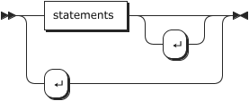

`

[line](#line "line")     ::= [statements](#statements "statements") '↵'?

           | '↵'

`

referenced by:

*   [lines](#lines "lines")

  

statements:

`

[statements](#statements "statements")

         ::= [statement](#statement "statement")+

`

referenced by:

*   [line](#line "line")
*   [statement](#statement "statement")

  

statement:

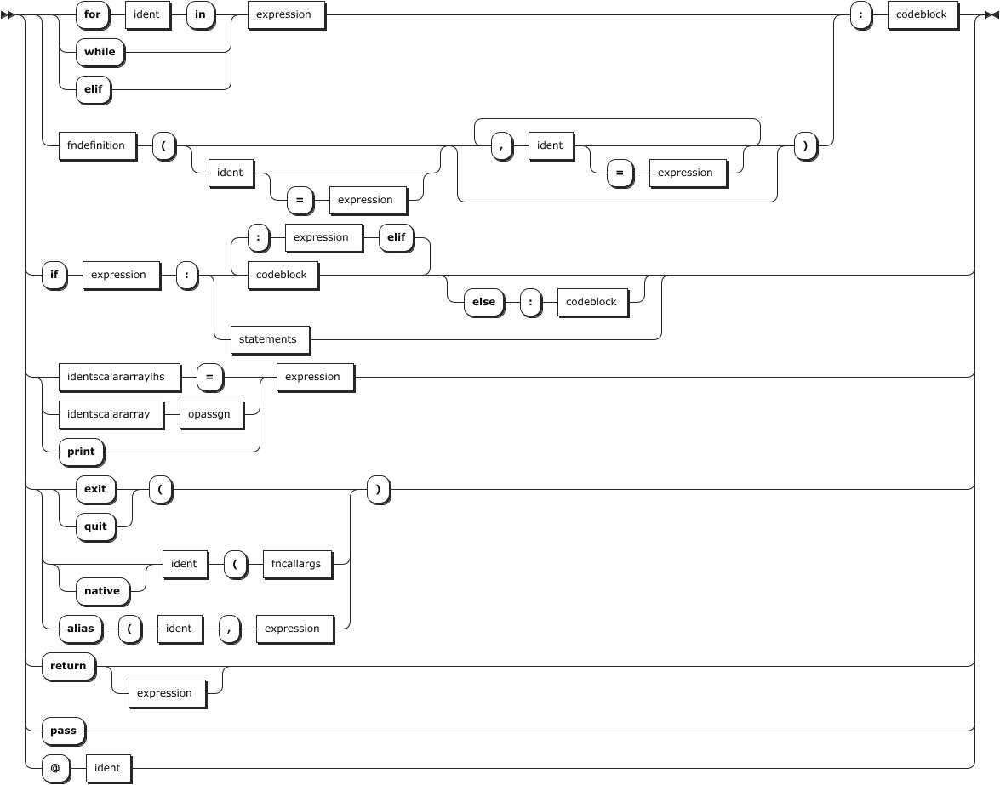

`

[statement](#statement "statement")

         ::= ( ( 'for' [ident](#ident "ident") 'in' | 'while' | 'elif' ) [expression](#expression "expression") | [fndefinition](#fndefinition "fndefinition") '(' ( [ident](#ident "ident") ( '=' [expression](#expression "expression") )? )? ( ',' [ident](#ident "ident") ( '=' [expression](#expression "expression") )? )* ')' ) ':' [codeblock](#codeblock "codeblock")

           | 'if' [expression](#expression "expression") ':' ( [codeblock](#codeblock "codeblock") ( 'elif' [expression](#expression "expression") ':' [codeblock](#codeblock "codeblock") )* ( 'else' ':' [codeblock](#codeblock "codeblock") )? | [statements](#statements "statements") )

           | ( [identscalararraylhs](#identscalararraylhs "identscalararraylhs") '=' | [identscalararray](#identscalararray "identscalararray") [opassgn](#opassgn "opassgn") | 'print' ) [expression](#expression "expression")

           | ( ( 'exit' | 'quit' ) '(' | 'native'? [ident](#ident "ident") '(' [fncallargs](#fncallargs "fncallargs") | 'alias' '(' [ident](#ident "ident") ',' [expression](#expression "expression") ) ')'

           | 'return' [expression](#expression "expression")?

           | 'pass'

           | '@' [ident](#ident "ident")

`

referenced by:

*   [statements](#statements "statements")

  

arrayaccessor:

`

[arrayaccessor](#arrayaccessor "arrayaccessor")

         ::= ( '[' [expression](#expression "expression") ']' )+

`

referenced by:

*   [identscalararray](#identscalararray "identscalararray")
*   [identscalararraylhs](#identscalararraylhs "identscalararraylhs")

  

fncallargs:

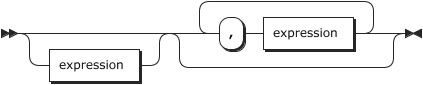

`

[fncallargs](#fncallargs "fncallargs")

         ::= [expression](#expression "expression")? ( ',' [expression](#expression "expression") )*

`

referenced by:

*   [statement](#statement "statement")
*   [value](#value "value")

  

fndefinition:

`

[fndefinition](#fndefinition "fndefinition")

         ::= 'def' [ident](#ident "ident")

`

referenced by:

*   [statement](#statement "statement")

  

codeblock:

`

[codeblock](#codeblock "codeblock")

         ::= '↵' '⇥' [lines](#lines "lines") '⇤'

`

referenced by:

*   [statement](#statement "statement")

  

opassgn:

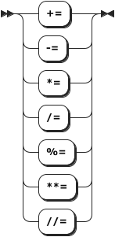

`

[opassgn](#opassgn "opassgn")  ::= '+='

           | '-='

           | '*='

           | '/='

           | '%='

           | '**='

           | '//='

`

referenced by:

*   [statement](#statement "statement")

  

declareident:

`

[declareident](#declareident "declareident")

         ::= [ident](#ident "ident")

`

no references

  

expression:

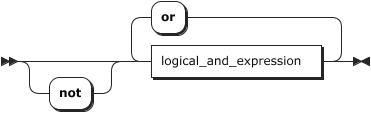

`

[expression](#expression "expression")

         ::= 'not'? [logical_and_expression](#logical_and_expression "logical_and_expression") ( 'or' [logical_and_expression](#logical_and_expression "logical_and_expression") )*

`

referenced by:

*   [arrayaccessor](#arrayaccessor "arrayaccessor")
*   [fncallargs](#fncallargs "fncallargs")
*   [multiplicative\_expression](#multiplicative_expression "multiplicative_expression")
*   [statement](#statement "statement")
*   [value](#value "value")

  

logical\_and\_expression:

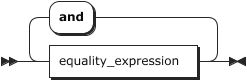

`

[logical_and_expression](#logical_and_expression "logical_and_expression")

         ::= [equality_expression](#equality_expression "equality_expression") ( 'and' [equality_expression](#equality_expression "equality_expression") )*

`

referenced by:

*   [expression](#expression "expression")

  

equality\_expression:

`

[equality_expression](#equality_expression "equality_expression")

         ::= [relational_expression](#relational_expression "relational_expression") ( ( '==' | [NEQ](#NEQ "NEQ") | 'is' ) [relational_expression](#relational_expression "relational_expression") )*

`

referenced by:

*   [logical\_and\_expression](#logical_and_expression "logical_and_expression")

  

relational\_expression:

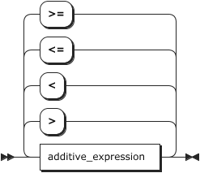

`

[relational_expression](#relational_expression "relational_expression")

         ::= [additive_expression](#additive_expression "additive_expression") ( ( '>' | '<' | '<=' | '>=' ) [additive_expression](#additive_expression "additive_expression") )*

`

referenced by:

*   [equality\_expression](#equality_expression "equality_expression")

  

additive\_expression:

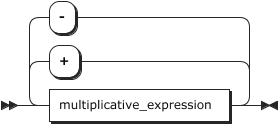

`

[additive_expression](#additive_expression "additive_expression")

         ::= [multiplicative_expression](#multiplicative_expression "multiplicative_expression") ( ( '+' | '-' ) [multiplicative_expression](#multiplicative_expression "multiplicative_expression") )*

`

referenced by:

*   [relational\_expression](#relational_expression "relational_expression")

  

multiplicative\_expression:

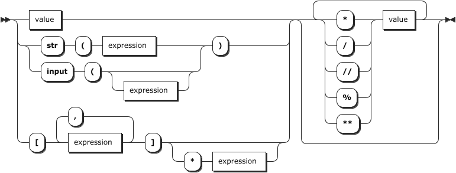

`

[multiplicative_expression](#multiplicative_expression "multiplicative_expression")

         ::= ( [value](#value "value") | ( 'str' '(' [expression](#expression "expression") | 'input' '(' [expression](#expression "expression")? ) ')' | '[' [expression](#expression "expression") ( ',' [expression](#expression "expression") )* ']' ( '*' [expression](#expression "expression") )? ) ( ( '*' | '/' | '//' | '%' | '**' ) [value](#value "value") )*

`

referenced by:

*   [additive\_expression](#additive_expression "additive_expression")

  

value:

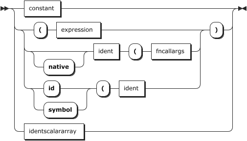

`

[value](#value "value")    ::= [constant](#constant "constant")

           | ( '(' [expression](#expression "expression") | 'native'? [ident](#ident "ident") '(' [fncallargs](#fncallargs "fncallargs") | ( 'id' | 'symbol' ) '(' [ident](#ident "ident") ) ')'

           | [identscalararray](#identscalararray "identscalararray")

`

referenced by:

*   [multiplicative\_expression](#multiplicative_expression "multiplicative_expression")

  

identscalararray:

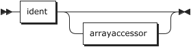

`

[identscalararray](#identscalararray "identscalararray")

         ::= [ident](#ident "ident") [arrayaccessor](#arrayaccessor "arrayaccessor")?

`

referenced by:

*   [statement](#statement "statement")
*   [value](#value "value")

  

identscalararraylhs:

`

[identscalararraylhs](#identscalararraylhs "identscalararraylhs")

         ::= [ident](#ident "ident") [arrayaccessor](#arrayaccessor "arrayaccessor")?

`

referenced by:

*   [statement](#statement "statement")

  

ident:

`

[ident](#ident "ident")    ::= [identifier](#identifier "identifier")

`

referenced by:

*   [declareident](#declareident "declareident")
*   [fndefinition](#fndefinition "fndefinition")
*   [identscalararray](#identscalararray "identscalararray")
*   [identscalararraylhs](#identscalararraylhs "identscalararraylhs")
*   [statement](#statement "statement")
*   [value](#value "value")

  

constant:

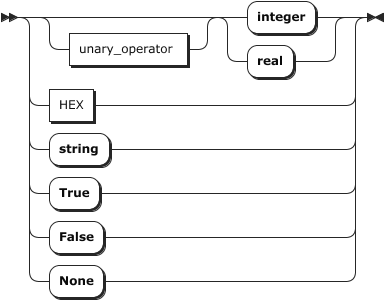

`

[constant](#constant "constant") ::= [unary_operator](#unary_operator "unary_operator")? ( 'integer' | 'real' )

           | [HEX](#HEX "HEX")

           | 'string'

           | 'True'

           | 'False'

           | 'None'

`

referenced by:

*   [value](#value "value")

  

unary\_operator:

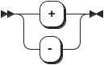

`

[unary_operator](#unary_operator "unary_operator")

         ::= '+'

           | '-'

`

referenced by:

*   [constant](#constant "constant")

  

identifier:

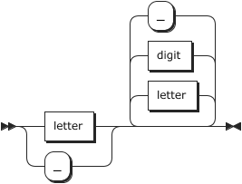

`

[identifier](#identifier "identifier")

         ::= ( [letter](#letter "letter") | '_' ) ( [letter](#letter "letter") | [digit](#digit "digit") | '_' )*

`

referenced by:

*   [ident](#ident "ident")

  

NEQ:

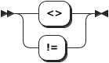

`

[NEQ](#NEQ "NEQ")      ::= '<>'

           | '!='

`

referenced by:

*   [equality\_expression](#equality_expression "equality_expression")

  

letter:

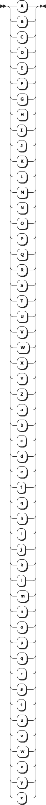

`

[letter](#letter "letter")   ::= 'A'

           | 'B'

           | 'C'

           | 'D'

           | 'E'

           | 'F'

           | 'G'

           | 'H'

           | 'I'

           | 'J'

           | 'K'

           | 'L'

           | 'M'

           | 'N'

           | 'O'

           | 'P'

           | 'Q'

           | 'R'

           | 'S'

           | 'T'

           | 'U'

           | 'V'

           | 'W'

           | 'X'

           | 'Y'

           | 'Z'

           | 'a'

           | 'b'

           | 'c'

           | 'd'

           | 'e'

           | 'f'

           | 'g'

           | 'h'

           | 'i'

           | 'j'

           | 'k'

           | 'l'

           | 'm'

           | 'n'

           | 'o'

           | 'p'

           | 'q'

           | 'r'

           | 's'

           | 't'

           | 'u'

           | 'v'

           | 'w'

           | 'x'

           | 'y'

           | 'z'

`

referenced by:

*   [identifier](#identifier "identifier")

  

digit:

`

[digit](#digit "digit")    ::= '0'

           | '1'

           | '2'

           | '3'

           | '4'

           | '5'

           | '6'

           | '7'

           | '8'

           | '9'

`

referenced by:

*   [HEX](#HEX "HEX")
*   [identifier](#identifier "identifier")

  

HEX:

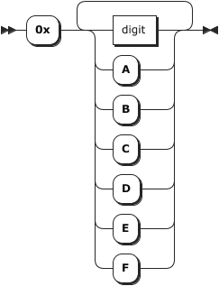

`

[HEX](#HEX "HEX")      ::= '0x' ( [digit](#digit "digit") | 'A' | 'B' | 'C' | 'D' | 'E' | 'F' )+

`

referenced by:

*   [constant](#constant "constant")

  

* * *

 

... generated by [RR - Railroad Diagram Generator](https://bottlecaps.de/rr/ui "https://bottlecaps.de/rr/ui")

