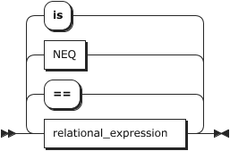
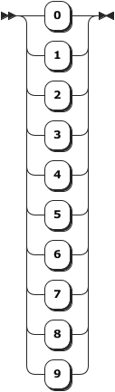

  
 
      
<a name="program">program:</a>
<map name="program.map"><area shape="rect" coords="29,1,79,33" href="#lines" title="lines"></map>

         
         

             <code>
               
<a href="#program" title="program">program</a>&nbsp;&nbsp;::= <a href="#lines" title="lines">lines</a>

               </code>
            

         

      
      
no references
 
<a name="lines">lines:</a>
<map name="lines.map"><area shape="rect" coords="49,17,91,49" href="#line" title="line"></map>

         
         
<code>
               
               
<a href="#lines" title="lines">lines</a>&nbsp;&nbsp;&nbsp;&nbsp;::= <a href="#line" title="line">line</a>+
</code>

         

      
      
referenced by:
         
         <ul>
            
            <li><a href="#codeblock" title="codeblock">codeblock</a></li>
            
            <li><a href="#program" title="program">program</a></li>
            </ul>
         
 
<a name="line">line:</a>
<map name="line.map"><area shape="rect" coords="49,1,141,33" href="#statements" title="statements"></map>

         
         
<code>
               
               
<a href="#line" title="line">line</a>&nbsp;&nbsp;&nbsp;&nbsp;&nbsp;::= <a href="#statements" title="statements">statements</a> '↵'?

               
               
&nbsp;&nbsp;&nbsp;&nbsp;&nbsp;&nbsp;&nbsp;&nbsp;&nbsp;&nbsp;&nbsp;| '↵'
</code>

         

      
      
referenced by:
         
         <ul>
            
            <li><a href="#lines" title="lines">lines</a></li>
            </ul>
         
 
<a name="statements">statements:</a>
<map name="statements.map"><area shape="rect" coords="49,17,135,49" href="#statement" title="statement"></map>

         
         
<code>
               
               
<a href="#statements" title="statements">statements</a>

               
               
&nbsp;&nbsp;&nbsp;&nbsp;&nbsp;&nbsp;&nbsp;&nbsp;&nbsp;::= <a href="#statement" title="statement">statement</a>+
</code>

         

      
      
referenced by:
         
         <ul>
            
            <li><a href="#line" title="line">line</a></li>
            
            <li><a href="#statement" title="statement">statement</a></li>
            </ul>
         
 
<a name="statement">statement:</a>
<map name="statement.map"><area shape="rect" coords="147,1,199,33" href="#ident" title="ident"><area shape="rect" coords="291,1,381,33" href="#expression" title="expression"><area shape="rect" coords="69,155,159,187" href="#fndefinition" title="fndefinition"><area shape="rect" coords="245,187,297,219" href="#ident" title="ident"><area shape="rect" coords="387,219,477,251" href="#expression" title="expression"><area shape="rect" coords="621,155,673,187" href="#ident" title="ident"><area shape="rect" coords="763,187,853,219" href="#expression" title="expression"><area shape="rect" coords="1043,1,1125,33" href="#codeblock" title="codeblock"><area shape="rect" coords="97,307,187,339" href="#expression" title="expression"><area shape="rect" coords="291,307,373,339" href="#codeblock" title="codeblock"><area shape="rect" coords="335,263,425,295" href="#expression" title="expression"><area shape="rect" coords="655,339,737,371" href="#codeblock" title="codeblock"><area shape="rect" coords="271,383,363,415" href="#statements" title="statements"><area shape="rect" coords="69,427,211,459" href="#identscalararraylhs" title="identscalararraylhs"><area shape="rect" coords="69,471,191,503" href="#identscalararray" title="identscalararray"><area shape="rect" coords="211,471,285,503" href="#opassgn" title="opassgn"><area shape="rect" coords="325,427,415,459" href="#expression" title="expression"><area shape="rect" coords="191,647,243,679" href="#ident" title="ident"><area shape="rect" coords="309,647,389,679" href="#fncallargs" title="fncallargs"><area shape="rect" coords="185,723,237,755" href="#ident" title="ident"><area shape="rect" coords="301,723,391,755" href="#expression" title="expression"><area shape="rect" coords="151,799,241,831" href="#expression" title="expression"><area shape="rect" coords="101,887,153,919" href="#ident" title="ident"></map>

         
         
<code>
               
               
<a href="#statement" title="statement">statement</a>

               
               
&nbsp;&nbsp;&nbsp;&nbsp;&nbsp;&nbsp;&nbsp;&nbsp;&nbsp;::= ( ( 'for' <a href="#ident" title="ident">ident</a> 'in' | 'while' | 'elif' ) <a href="#expression" title="expression">expression</a> | <a href="#fndefinition" title="fndefinition">fndefinition</a> '(' ( <a href="#ident" title="ident">ident</a> ( '=' <a href="#expression" title="expression">expression</a> )? )? ( ',' <a href="#ident" title="ident">ident</a> ( '=' <a href="#expression" title="expression">expression</a> )? )* ')' ) ':' <a href="#codeblock" title="codeblock">codeblock</a>

               
               
&nbsp;&nbsp;&nbsp;&nbsp;&nbsp;&nbsp;&nbsp;&nbsp;&nbsp;&nbsp;&nbsp;| 'if' <a href="#expression" title="expression">expression</a> ':' ( <a href="#codeblock" title="codeblock">codeblock</a> ( 'elif' <a href="#expression" title="expression">expression</a> ':' <a href="#codeblock" title="codeblock">codeblock</a> )* ( 'else' ':' <a href="#codeblock" title="codeblock">codeblock</a> )? | <a href="#statements" title="statements">statements</a> )

               
               
&nbsp;&nbsp;&nbsp;&nbsp;&nbsp;&nbsp;&nbsp;&nbsp;&nbsp;&nbsp;&nbsp;| ( <a href="#identscalararraylhs" title="identscalararraylhs">identscalararraylhs</a> '=' | <a href="#identscalararray" title="identscalararray">identscalararray</a> <a href="#opassgn" title="opassgn">opassgn</a> | 'print' ) <a href="#expression" title="expression">expression</a>

               
               
&nbsp;&nbsp;&nbsp;&nbsp;&nbsp;&nbsp;&nbsp;&nbsp;&nbsp;&nbsp;&nbsp;| ( ( 'exit' | 'quit' ) '(' | 'native'? <a href="#ident" title="ident">ident</a> '(' <a href="#fncallargs" title="fncallargs">fncallargs</a> | 'alias' '(' <a href="#ident" title="ident">ident</a> ',' <a href="#expression" title="expression">expression</a> ) ')'

               
               
&nbsp;&nbsp;&nbsp;&nbsp;&nbsp;&nbsp;&nbsp;&nbsp;&nbsp;&nbsp;&nbsp;| 'return' <a href="#expression" title="expression">expression</a>?

               
               
&nbsp;&nbsp;&nbsp;&nbsp;&nbsp;&nbsp;&nbsp;&nbsp;&nbsp;&nbsp;&nbsp;| 'pass'

               
               
&nbsp;&nbsp;&nbsp;&nbsp;&nbsp;&nbsp;&nbsp;&nbsp;&nbsp;&nbsp;&nbsp;| '@' <a href="#ident" title="ident">ident</a>
</code>

         

      
      
referenced by:
         
         <ul>
            
            <li><a href="#statements" title="statements">statements</a></li>
            </ul>
         
 
<a name="arrayaccessor">arrayaccessor:</a>
<map name="arrayaccessor.map"><area shape="rect" coords="95,17,185,49" href="#expression" title="expression"></map>

         
         
<code>
               
               
<a href="#arrayaccessor" title="arrayaccessor">arrayaccessor</a>

               
               
&nbsp;&nbsp;&nbsp;&nbsp;&nbsp;&nbsp;&nbsp;&nbsp;&nbsp;::= ( '[' <a href="#expression" title="expression">expression</a> ']' )+
</code>

         

      
      
referenced by:
         
         <ul>
            
            <li><a href="#identscalararray" title="identscalararray">identscalararray</a></li>
            
            <li><a href="#identscalararraylhs" title="identscalararraylhs">identscalararraylhs</a></li>
            </ul>
         
 
<a name="fncallargs">fncallargs:</a>
<map name="fncallargs.map"><area shape="rect" coords="49,49,139,81" href="#expression" title="expression"><area shape="rect" coords="263,17,353,49" href="#expression" title="expression"></map>

         
         
<code>
               
               
<a href="#fncallargs" title="fncallargs">fncallargs</a>

               
               
&nbsp;&nbsp;&nbsp;&nbsp;&nbsp;&nbsp;&nbsp;&nbsp;&nbsp;::= <a href="#expression" title="expression">expression</a>? ( ',' <a href="#expression" title="expression">expression</a> )*
</code>

         

      
      
referenced by:
         
         <ul>
            
            <li><a href="#statement" title="statement">statement</a></li>
            
            <li><a href="#value" title="value">value</a></li>
            </ul>
         
 
<a name="fndefinition">fndefinition:</a>
<map name="fndefinition.map"><area shape="rect" coords="91,1,143,33" href="#ident" title="ident"></map>

         
         
<code>
               
               
<a href="#fndefinition" title="fndefinition">fndefinition</a>

               
               
&nbsp;&nbsp;&nbsp;&nbsp;&nbsp;&nbsp;&nbsp;&nbsp;&nbsp;::= 'def' <a href="#ident" title="ident">ident</a>
</code>

         

      
      
referenced by:
         
         <ul>
            
            <li><a href="#statement" title="statement">statement</a></li>
            </ul>
         
 
<a name="codeblock">codeblock:</a>
<map name="codeblock.map"><area shape="rect" coords="125,1,175,33" href="#lines" title="lines"></map>

         
         
<code>
               
               
<a href="#codeblock" title="codeblock">codeblock</a>

               
               
&nbsp;&nbsp;&nbsp;&nbsp;&nbsp;&nbsp;&nbsp;&nbsp;&nbsp;::= '↵' '⇥' <a href="#lines" title="lines">lines</a> '⇤'
</code>

         

      
      
referenced by:
         
         <ul>
            
            <li><a href="#statement" title="statement">statement</a></li>
            </ul>
         
 
<a name="opassgn">opassgn:</a>

         
         
<code>
               
               
<a href="#opassgn" title="opassgn">opassgn</a>&nbsp;&nbsp;::= '+='

               
               
&nbsp;&nbsp;&nbsp;&nbsp;&nbsp;&nbsp;&nbsp;&nbsp;&nbsp;&nbsp;&nbsp;| '-='

               
               
&nbsp;&nbsp;&nbsp;&nbsp;&nbsp;&nbsp;&nbsp;&nbsp;&nbsp;&nbsp;&nbsp;| '*='

               
               
&nbsp;&nbsp;&nbsp;&nbsp;&nbsp;&nbsp;&nbsp;&nbsp;&nbsp;&nbsp;&nbsp;| '/='

               
               
&nbsp;&nbsp;&nbsp;&nbsp;&nbsp;&nbsp;&nbsp;&nbsp;&nbsp;&nbsp;&nbsp;| '%='

               
               
&nbsp;&nbsp;&nbsp;&nbsp;&nbsp;&nbsp;&nbsp;&nbsp;&nbsp;&nbsp;&nbsp;| '**='

               
               
&nbsp;&nbsp;&nbsp;&nbsp;&nbsp;&nbsp;&nbsp;&nbsp;&nbsp;&nbsp;&nbsp;| '//='
</code>

         

      
      
referenced by:
         
         <ul>
            
            <li><a href="#statement" title="statement">statement</a></li>
            </ul>
         
 
<a name="declareident">declareident:</a>
<map name="declareident.map"><area shape="rect" coords="29,1,81,33" href="#ident" title="ident"></map>

         
         
<code>
               
               
<a href="#declareident" title="declareident">declareident</a>

               
               
&nbsp;&nbsp;&nbsp;&nbsp;&nbsp;&nbsp;&nbsp;&nbsp;&nbsp;::= <a href="#ident" title="ident">ident</a>
</code>

         

      
      
no references
 
<a name="expression">expression:</a>
<map name="expression.map"><area shape="rect" coords="151,45,321,77" href="#logical_and_expression" title="logical_and_expression"></map>

         
         
<code>
               
               
<a href="#expression" title="expression">expression</a>

               
               
&nbsp;&nbsp;&nbsp;&nbsp;&nbsp;&nbsp;&nbsp;&nbsp;&nbsp;::= 'not'? <a href="#logical_and_expression" title="logical_and_expression">logical_and_expression</a> ( 'or' <a href="#logical_and_expression" title="logical_and_expression">logical_and_expression</a> )*
</code>

         

      
      
referenced by:
         
         <ul>
            
            <li><a href="#arrayaccessor" title="arrayaccessor">arrayaccessor</a></li>
            
            <li><a href="#fncallargs" title="fncallargs">fncallargs</a></li>
            
            <li><a href="#multiplicative_expression" title="multiplicative_expression">multiplicative_expression</a></li>
            
            <li><a href="#statement" title="statement">statement</a></li>
            
            <li><a href="#value" title="value">value</a></li>
            </ul>
         
 
<a name="logical_and_expression">logical_and_expression:</a>
<map name="logical_and_expression.map"><area shape="rect" coords="49,45,197,77" href="#equality_expression" title="equality_expression"></map>

         
         
<code>
               
               
<a href="#logical_and_expression" title="logical_and_expression">logical_and_expression</a>

               
               
&nbsp;&nbsp;&nbsp;&nbsp;&nbsp;&nbsp;&nbsp;&nbsp;&nbsp;::= <a href="#equality_expression" title="equality_expression">equality_expression</a> ( 'and' <a href="#equality_expression" title="equality_expression">equality_expression</a> )*
</code>

         

      
      
referenced by:
         
         <ul>
            
            <li><a href="#expression" title="expression">expression</a></li>
            </ul>
         
 
<a name="equality_expression">equality_expression:</a>
<map name="equality_expression.map"><area shape="rect" coords="49,133,207,165" href="#relational_expression" title="relational_expression"><area shape="rect" coords="49,45,95,77" href="#NEQ" title="NEQ"></map>

         
         
<code>
               
               
<a href="#equality_expression" title="equality_expression">equality_expression</a>

               
               
&nbsp;&nbsp;&nbsp;&nbsp;&nbsp;&nbsp;&nbsp;&nbsp;&nbsp;::= <a href="#relational_expression" title="relational_expression">relational_expression</a> ( ( '==' | <a href="#NEQ" title="NEQ">NEQ</a> | 'is' ) <a href="#relational_expression" title="relational_expression">relational_expression</a> )*
</code>

         

      
      
referenced by:
         
         <ul>
            
            <li><a href="#logical_and_expression" title="logical_and_expression">logical_and_expression</a></li>
            </ul>
         
 
<a name="relational_expression">relational_expression:</a>
<map name="relational_expression.map"><area shape="rect" coords="49,177,197,209" href="#additive_expression" title="additive_expression"></map>

         
         
<code>
               
               
<a href="#relational_expression" title="relational_expression">relational_expression</a>

               
               
&nbsp;&nbsp;&nbsp;&nbsp;&nbsp;&nbsp;&nbsp;&nbsp;&nbsp;::= <a href="#additive_expression" title="additive_expression">additive_expression</a> ( ( '&gt;' | '&lt;' | '&lt;=' | '&gt;=' ) <a href="#additive_expression" title="additive_expression">additive_expression</a> )*
</code>

         

      
      
referenced by:
         
         <ul>
            
            <li><a href="#equality_expression" title="equality_expression">equality_expression</a></li>
            </ul>
         
 
<a name="additive_expression">additive_expression:</a>
<map name="additive_expression.map"><area shape="rect" coords="49,89,229,121" href="#multiplicative_expression" title="multiplicative_expression"></map>

         
         
<code>
               
               
<a href="#additive_expression" title="additive_expression">additive_expression</a>

               
               
&nbsp;&nbsp;&nbsp;&nbsp;&nbsp;&nbsp;&nbsp;&nbsp;&nbsp;::= <a href="#multiplicative_expression" title="multiplicative_expression">multiplicative_expression</a> ( ( '+' | '-' ) <a href="#multiplicative_expression" title="multiplicative_expression">multiplicative_expression</a> )*
</code>

         

      
      
referenced by:
         
         <ul>
            
            <li><a href="#relational_expression" title="relational_expression">relational_expression</a></li>
            </ul>
         
 
<a name="multiplicative_expression">multiplicative_expression:</a>
<map name="multiplicative_expression.map"><area shape="rect" coords="49,17,103,49" href="#value" title="value"><area shape="rect" coords="173,61,263,93" href="#expression" title="expression"><area shape="rect" coords="209,137,299,169" href="#expression" title="expression"><area shape="rect" coords="115,225,205,257" href="#expression" title="expression"><area shape="rect" coords="359,257,449,289" href="#expression" title="expression"><area shape="rect" coords="647,17,701,49" href="#value" title="value"></map>

         
         
<code>
               
               
<a href="#multiplicative_expression" title="multiplicative_expression">multiplicative_expression</a>

               
               
&nbsp;&nbsp;&nbsp;&nbsp;&nbsp;&nbsp;&nbsp;&nbsp;&nbsp;::= ( <a href="#value" title="value">value</a> | ( 'str' '(' <a href="#expression" title="expression">expression</a> | 'input' '(' <a href="#expression" title="expression">expression</a>? ) ')' | '[' <a href="#expression" title="expression">expression</a> ( ',' <a href="#expression" title="expression">expression</a> )* ']' ( '*' <a href="#expression" title="expression">expression</a> )? ) ( ( '*' | '/' | '//' | '%' | '**' ) <a href="#value" title="value">value</a> )*
</code>

         

      
      
referenced by:
         
         <ul>
            
            <li><a href="#additive_expression" title="additive_expression">additive_expression</a></li>
            </ul>
         
 
<a name="value">value:</a>
<map name="value.map"><area shape="rect" coords="49,1,123,33" href="#constant" title="constant"><area shape="rect" coords="115,45,205,77" href="#expression" title="expression"><area shape="rect" coords="191,89,243,121" href="#ident" title="ident"><area shape="rect" coords="309,89,389,121" href="#fncallargs" title="fncallargs"><area shape="rect" coords="243,165,295,197" href="#ident" title="ident"><area shape="rect" coords="49,253,171,285" href="#identscalararray" title="identscalararray"></map>

         
         
<code>
               
               
<a href="#value" title="value">value</a>&nbsp;&nbsp;&nbsp;&nbsp;::= <a href="#constant" title="constant">constant</a>

               
               
&nbsp;&nbsp;&nbsp;&nbsp;&nbsp;&nbsp;&nbsp;&nbsp;&nbsp;&nbsp;&nbsp;| ( '(' <a href="#expression" title="expression">expression</a> | 'native'? <a href="#ident" title="ident">ident</a> '(' <a href="#fncallargs" title="fncallargs">fncallargs</a> | ( 'id' | 'symbol' ) '(' <a href="#ident" title="ident">ident</a> ) ')'

               
               
&nbsp;&nbsp;&nbsp;&nbsp;&nbsp;&nbsp;&nbsp;&nbsp;&nbsp;&nbsp;&nbsp;| <a href="#identscalararray" title="identscalararray">identscalararray</a>
</code>

         

      
      
referenced by:
         
         <ul>
            
            <li><a href="#multiplicative_expression" title="multiplicative_expression">multiplicative_expression</a></li>
            </ul>
         
 
<a name="identscalararray">identscalararray:</a>
<map name="identscalararray.map"><area shape="rect" coords="29,1,81,33" href="#ident" title="ident"><area shape="rect" coords="121,33,229,65" href="#arrayaccessor" title="arrayaccessor"></map>

         
         
<code>
               
               
<a href="#identscalararray" title="identscalararray">identscalararray</a>

               
               
&nbsp;&nbsp;&nbsp;&nbsp;&nbsp;&nbsp;&nbsp;&nbsp;&nbsp;::= <a href="#ident" title="ident">ident</a> <a href="#arrayaccessor" title="arrayaccessor">arrayaccessor</a>?
</code>

         

      
      
referenced by:
         
         <ul>
            
            <li><a href="#statement" title="statement">statement</a></li>
            
            <li><a href="#value" title="value">value</a></li>
            </ul>
         
 
<a name="identscalararraylhs">identscalararraylhs:</a>
<map name="identscalararraylhs.map"><area shape="rect" coords="29,1,81,33" href="#ident" title="ident"><area shape="rect" coords="121,33,229,65" href="#arrayaccessor" title="arrayaccessor"></map>

         
         
<code>
               
               
<a href="#identscalararraylhs" title="identscalararraylhs">identscalararraylhs</a>

               
               
&nbsp;&nbsp;&nbsp;&nbsp;&nbsp;&nbsp;&nbsp;&nbsp;&nbsp;::= <a href="#ident" title="ident">ident</a> <a href="#arrayaccessor" title="arrayaccessor">arrayaccessor</a>?
</code>

         

      
      
referenced by:
         
         <ul>
            
            <li><a href="#statement" title="statement">statement</a></li>
            </ul>
         
 
<a name="ident">ident:</a>
<map name="ident.map"><area shape="rect" coords="29,1,105,33" href="#identifier" title="identifier"></map>

         
         
<code>
               
               
<a href="#ident" title="ident">ident</a>&nbsp;&nbsp;&nbsp;&nbsp;::= <a href="#identifier" title="identifier">identifier</a>
</code>

         

      
      
referenced by:
         
         <ul>
            
            <li><a href="#declareident" title="declareident">declareident</a></li>
            
            <li><a href="#fndefinition" title="fndefinition">fndefinition</a></li>
            
            <li><a href="#identscalararray" title="identscalararray">identscalararray</a></li>
            
            <li><a href="#identscalararraylhs" title="identscalararraylhs">identscalararraylhs</a></li>
            
            <li><a href="#statement" title="statement">statement</a></li>
            
            <li><a href="#value" title="value">value</a></li>
            </ul>
         
 
<a name="constant">constant:</a>
<map name="constant.map"><area shape="rect" coords="69,33,187,65" href="#unary_operator" title="unary_operator"><area shape="rect" coords="49,89,93,121" href="#HEX" title="HEX"></map>

         
         
<code>
               
               
<a href="#constant" title="constant">constant</a>&nbsp;::= <a href="#unary_operator" title="unary_operator">unary_operator</a>? ( 'integer' | 'real' )

               
               
&nbsp;&nbsp;&nbsp;&nbsp;&nbsp;&nbsp;&nbsp;&nbsp;&nbsp;&nbsp;&nbsp;| <a href="#HEX" title="HEX">HEX</a>

               
               
&nbsp;&nbsp;&nbsp;&nbsp;&nbsp;&nbsp;&nbsp;&nbsp;&nbsp;&nbsp;&nbsp;| 'string'

               
               
&nbsp;&nbsp;&nbsp;&nbsp;&nbsp;&nbsp;&nbsp;&nbsp;&nbsp;&nbsp;&nbsp;| 'True'

               
               
&nbsp;&nbsp;&nbsp;&nbsp;&nbsp;&nbsp;&nbsp;&nbsp;&nbsp;&nbsp;&nbsp;| 'False'

               
               
&nbsp;&nbsp;&nbsp;&nbsp;&nbsp;&nbsp;&nbsp;&nbsp;&nbsp;&nbsp;&nbsp;| 'None'
</code>

         

      
      
referenced by:
         
         <ul>
            
            <li><a href="#value" title="value">value</a></li>
            </ul>
         
 
<a name="unary_operator">unary_operator:</a>

         
         
<code>
               
               
<a href="#unary_operator" title="unary_operator">unary_operator</a>

               
               
&nbsp;&nbsp;&nbsp;&nbsp;&nbsp;&nbsp;&nbsp;&nbsp;&nbsp;::= '+'

               
               
&nbsp;&nbsp;&nbsp;&nbsp;&nbsp;&nbsp;&nbsp;&nbsp;&nbsp;&nbsp;&nbsp;| '-'
</code>

         

      
      
referenced by:
         
         <ul>
            
            <li><a href="#constant" title="constant">constant</a></li>
            </ul>
         
 
<a name="identifier">identifier:</a>
<map name="identifier.map"><area shape="rect" coords="49,123,103,155" href="#letter" title="letter"><area shape="rect" coords="163,89,217,121" href="#letter" title="letter"><area shape="rect" coords="163,45,211,77" href="#digit" title="digit"></map>

         
         
<code>
               
               
<a href="#identifier" title="identifier">identifier</a>

               
               
&nbsp;&nbsp;&nbsp;&nbsp;&nbsp;&nbsp;&nbsp;&nbsp;&nbsp;::= ( <a href="#letter" title="letter">letter</a> | '_' ) ( <a href="#letter" title="letter">letter</a> | <a href="#digit" title="digit">digit</a> | '_' )*
</code>

         

      
      
referenced by:
         
         <ul>
            
            <li><a href="#ident" title="ident">ident</a></li>
            </ul>
         
 
<a name="NEQ">NEQ:</a>

         
         
<code>
               
               
<a href="#NEQ" title="NEQ">NEQ</a>&nbsp;&nbsp;&nbsp;&nbsp;&nbsp;&nbsp;::= '&lt;&gt;'

               
               
&nbsp;&nbsp;&nbsp;&nbsp;&nbsp;&nbsp;&nbsp;&nbsp;&nbsp;&nbsp;&nbsp;| '!='
</code>

         

      
      
referenced by:
         
         <ul>
            
            <li><a href="#equality_expression" title="equality_expression">equality_expression</a></li>
            </ul>
         
 
<a name="letter">letter:</a>

         
         
<code>
               
               
<a href="#letter" title="letter">letter</a>&nbsp;&nbsp;&nbsp;::= 'A'

               
               
&nbsp;&nbsp;&nbsp;&nbsp;&nbsp;&nbsp;&nbsp;&nbsp;&nbsp;&nbsp;&nbsp;| 'B'

               
               
&nbsp;&nbsp;&nbsp;&nbsp;&nbsp;&nbsp;&nbsp;&nbsp;&nbsp;&nbsp;&nbsp;| 'C'

               
               
&nbsp;&nbsp;&nbsp;&nbsp;&nbsp;&nbsp;&nbsp;&nbsp;&nbsp;&nbsp;&nbsp;| 'D'

               
               
&nbsp;&nbsp;&nbsp;&nbsp;&nbsp;&nbsp;&nbsp;&nbsp;&nbsp;&nbsp;&nbsp;| 'E'

               
               
&nbsp;&nbsp;&nbsp;&nbsp;&nbsp;&nbsp;&nbsp;&nbsp;&nbsp;&nbsp;&nbsp;| 'F'

               
               
&nbsp;&nbsp;&nbsp;&nbsp;&nbsp;&nbsp;&nbsp;&nbsp;&nbsp;&nbsp;&nbsp;| 'G'

               
               
&nbsp;&nbsp;&nbsp;&nbsp;&nbsp;&nbsp;&nbsp;&nbsp;&nbsp;&nbsp;&nbsp;| 'H'

               
               
&nbsp;&nbsp;&nbsp;&nbsp;&nbsp;&nbsp;&nbsp;&nbsp;&nbsp;&nbsp;&nbsp;| 'I'

               
               
&nbsp;&nbsp;&nbsp;&nbsp;&nbsp;&nbsp;&nbsp;&nbsp;&nbsp;&nbsp;&nbsp;| 'J'

               
               
&nbsp;&nbsp;&nbsp;&nbsp;&nbsp;&nbsp;&nbsp;&nbsp;&nbsp;&nbsp;&nbsp;| 'K'

               
               
&nbsp;&nbsp;&nbsp;&nbsp;&nbsp;&nbsp;&nbsp;&nbsp;&nbsp;&nbsp;&nbsp;| 'L'

               
               
&nbsp;&nbsp;&nbsp;&nbsp;&nbsp;&nbsp;&nbsp;&nbsp;&nbsp;&nbsp;&nbsp;| 'M'

               
               
&nbsp;&nbsp;&nbsp;&nbsp;&nbsp;&nbsp;&nbsp;&nbsp;&nbsp;&nbsp;&nbsp;| 'N'

               
               
&nbsp;&nbsp;&nbsp;&nbsp;&nbsp;&nbsp;&nbsp;&nbsp;&nbsp;&nbsp;&nbsp;| 'O'

               
               
&nbsp;&nbsp;&nbsp;&nbsp;&nbsp;&nbsp;&nbsp;&nbsp;&nbsp;&nbsp;&nbsp;| 'P'

               
               
&nbsp;&nbsp;&nbsp;&nbsp;&nbsp;&nbsp;&nbsp;&nbsp;&nbsp;&nbsp;&nbsp;| 'Q'

               
               
&nbsp;&nbsp;&nbsp;&nbsp;&nbsp;&nbsp;&nbsp;&nbsp;&nbsp;&nbsp;&nbsp;| 'R'

               
               
&nbsp;&nbsp;&nbsp;&nbsp;&nbsp;&nbsp;&nbsp;&nbsp;&nbsp;&nbsp;&nbsp;| 'S'

               
               
&nbsp;&nbsp;&nbsp;&nbsp;&nbsp;&nbsp;&nbsp;&nbsp;&nbsp;&nbsp;&nbsp;| 'T'

               
               
&nbsp;&nbsp;&nbsp;&nbsp;&nbsp;&nbsp;&nbsp;&nbsp;&nbsp;&nbsp;&nbsp;| 'U'

               
               
&nbsp;&nbsp;&nbsp;&nbsp;&nbsp;&nbsp;&nbsp;&nbsp;&nbsp;&nbsp;&nbsp;| 'V'

               
               
&nbsp;&nbsp;&nbsp;&nbsp;&nbsp;&nbsp;&nbsp;&nbsp;&nbsp;&nbsp;&nbsp;| 'W'

               
               
&nbsp;&nbsp;&nbsp;&nbsp;&nbsp;&nbsp;&nbsp;&nbsp;&nbsp;&nbsp;&nbsp;| 'X'

               
               
&nbsp;&nbsp;&nbsp;&nbsp;&nbsp;&nbsp;&nbsp;&nbsp;&nbsp;&nbsp;&nbsp;| 'Y'

               
               
&nbsp;&nbsp;&nbsp;&nbsp;&nbsp;&nbsp;&nbsp;&nbsp;&nbsp;&nbsp;&nbsp;| 'Z'

               
               
&nbsp;&nbsp;&nbsp;&nbsp;&nbsp;&nbsp;&nbsp;&nbsp;&nbsp;&nbsp;&nbsp;| 'a'

               
               
&nbsp;&nbsp;&nbsp;&nbsp;&nbsp;&nbsp;&nbsp;&nbsp;&nbsp;&nbsp;&nbsp;| 'b'

               
               
&nbsp;&nbsp;&nbsp;&nbsp;&nbsp;&nbsp;&nbsp;&nbsp;&nbsp;&nbsp;&nbsp;| 'c'

               
               
&nbsp;&nbsp;&nbsp;&nbsp;&nbsp;&nbsp;&nbsp;&nbsp;&nbsp;&nbsp;&nbsp;| 'd'

               
               
&nbsp;&nbsp;&nbsp;&nbsp;&nbsp;&nbsp;&nbsp;&nbsp;&nbsp;&nbsp;&nbsp;| 'e'

               
               
&nbsp;&nbsp;&nbsp;&nbsp;&nbsp;&nbsp;&nbsp;&nbsp;&nbsp;&nbsp;&nbsp;| 'f'

               
               
&nbsp;&nbsp;&nbsp;&nbsp;&nbsp;&nbsp;&nbsp;&nbsp;&nbsp;&nbsp;&nbsp;| 'g'

               
               
&nbsp;&nbsp;&nbsp;&nbsp;&nbsp;&nbsp;&nbsp;&nbsp;&nbsp;&nbsp;&nbsp;| 'h'

               
               
&nbsp;&nbsp;&nbsp;&nbsp;&nbsp;&nbsp;&nbsp;&nbsp;&nbsp;&nbsp;&nbsp;| 'i'

               
               
&nbsp;&nbsp;&nbsp;&nbsp;&nbsp;&nbsp;&nbsp;&nbsp;&nbsp;&nbsp;&nbsp;| 'j'

               
               
&nbsp;&nbsp;&nbsp;&nbsp;&nbsp;&nbsp;&nbsp;&nbsp;&nbsp;&nbsp;&nbsp;| 'k'

               
               
&nbsp;&nbsp;&nbsp;&nbsp;&nbsp;&nbsp;&nbsp;&nbsp;&nbsp;&nbsp;&nbsp;| 'l'

               
               
&nbsp;&nbsp;&nbsp;&nbsp;&nbsp;&nbsp;&nbsp;&nbsp;&nbsp;&nbsp;&nbsp;| 'm'

               
               
&nbsp;&nbsp;&nbsp;&nbsp;&nbsp;&nbsp;&nbsp;&nbsp;&nbsp;&nbsp;&nbsp;| 'n'

               
               
&nbsp;&nbsp;&nbsp;&nbsp;&nbsp;&nbsp;&nbsp;&nbsp;&nbsp;&nbsp;&nbsp;| 'o'

               
               
&nbsp;&nbsp;&nbsp;&nbsp;&nbsp;&nbsp;&nbsp;&nbsp;&nbsp;&nbsp;&nbsp;| 'p'

               
               
&nbsp;&nbsp;&nbsp;&nbsp;&nbsp;&nbsp;&nbsp;&nbsp;&nbsp;&nbsp;&nbsp;| 'q'

               
               
&nbsp;&nbsp;&nbsp;&nbsp;&nbsp;&nbsp;&nbsp;&nbsp;&nbsp;&nbsp;&nbsp;| 'r'

               
               
&nbsp;&nbsp;&nbsp;&nbsp;&nbsp;&nbsp;&nbsp;&nbsp;&nbsp;&nbsp;&nbsp;| 's'

               
               
&nbsp;&nbsp;&nbsp;&nbsp;&nbsp;&nbsp;&nbsp;&nbsp;&nbsp;&nbsp;&nbsp;| 't'

               
               
&nbsp;&nbsp;&nbsp;&nbsp;&nbsp;&nbsp;&nbsp;&nbsp;&nbsp;&nbsp;&nbsp;| 'u'

               
               
&nbsp;&nbsp;&nbsp;&nbsp;&nbsp;&nbsp;&nbsp;&nbsp;&nbsp;&nbsp;&nbsp;| 'v'

               
               
&nbsp;&nbsp;&nbsp;&nbsp;&nbsp;&nbsp;&nbsp;&nbsp;&nbsp;&nbsp;&nbsp;| 'w'

               
               
&nbsp;&nbsp;&nbsp;&nbsp;&nbsp;&nbsp;&nbsp;&nbsp;&nbsp;&nbsp;&nbsp;| 'x'

               
               
&nbsp;&nbsp;&nbsp;&nbsp;&nbsp;&nbsp;&nbsp;&nbsp;&nbsp;&nbsp;&nbsp;| 'y'

               
               
&nbsp;&nbsp;&nbsp;&nbsp;&nbsp;&nbsp;&nbsp;&nbsp;&nbsp;&nbsp;&nbsp;| 'z'
</code>

         

      
      
referenced by:
         
         <ul>
            
            <li><a href="#identifier" title="identifier">identifier</a></li>
            </ul>
         
 
<a name="digit">digit:</a>

         
         
<code>
               
               
<a href="#digit" title="digit">digit</a>&nbsp;&nbsp;&nbsp;&nbsp;::= '0'

               
               
&nbsp;&nbsp;&nbsp;&nbsp;&nbsp;&nbsp;&nbsp;&nbsp;&nbsp;&nbsp;&nbsp;| '1'

               
               
&nbsp;&nbsp;&nbsp;&nbsp;&nbsp;&nbsp;&nbsp;&nbsp;&nbsp;&nbsp;&nbsp;| '2'

               
               
&nbsp;&nbsp;&nbsp;&nbsp;&nbsp;&nbsp;&nbsp;&nbsp;&nbsp;&nbsp;&nbsp;| '3'

               
               
&nbsp;&nbsp;&nbsp;&nbsp;&nbsp;&nbsp;&nbsp;&nbsp;&nbsp;&nbsp;&nbsp;| '4'

               
               
&nbsp;&nbsp;&nbsp;&nbsp;&nbsp;&nbsp;&nbsp;&nbsp;&nbsp;&nbsp;&nbsp;| '5'

               
               
&nbsp;&nbsp;&nbsp;&nbsp;&nbsp;&nbsp;&nbsp;&nbsp;&nbsp;&nbsp;&nbsp;| '6'

               
               
&nbsp;&nbsp;&nbsp;&nbsp;&nbsp;&nbsp;&nbsp;&nbsp;&nbsp;&nbsp;&nbsp;| '7'

               
               
&nbsp;&nbsp;&nbsp;&nbsp;&nbsp;&nbsp;&nbsp;&nbsp;&nbsp;&nbsp;&nbsp;| '8'

               
               
&nbsp;&nbsp;&nbsp;&nbsp;&nbsp;&nbsp;&nbsp;&nbsp;&nbsp;&nbsp;&nbsp;| '9'
</code>

         

      
      
referenced by:
         
         <ul>
            
            <li><a href="#HEX" title="HEX">HEX</a></li>
            
            <li><a href="#identifier" title="identifier">identifier</a></li>
            </ul>
         
 
<a name="HEX">HEX:</a>
<map name="HEX.map"><area shape="rect" coords="125,17,173,49" href="#digit" title="digit"></map>

         
         
<code>
               
               
<a href="#HEX" title="HEX">HEX</a>&nbsp;&nbsp;&nbsp;&nbsp;&nbsp;&nbsp;::= '0x' ( <a href="#digit" title="digit">digit</a> | 'A' | 'B' | 'C' | 'D' | 'E' | 'F' )+
</code>

         

      
      
referenced by:
         
         <ul>
            
            <li><a href="#constant" title="constant">constant</a></li>
            </ul>
         
 

      
      

         
         <table class="signature" border="0">
            
            <tr>
               
               <td style="width: 100%">&nbsp;</td>
               
               <td valign="top">
                  
                  <nobr class="signature">... generated by <a name="Railroad-Diagram-Generator" class="signature" title="https://bottlecaps.de/rr/ui" href="https://bottlecaps.de/rr/ui" target="_blank">RR - Railroad Diagram Generator</a></nobr>
                  </td>
               
               <td></td>
               </tr>
            </table>
         
